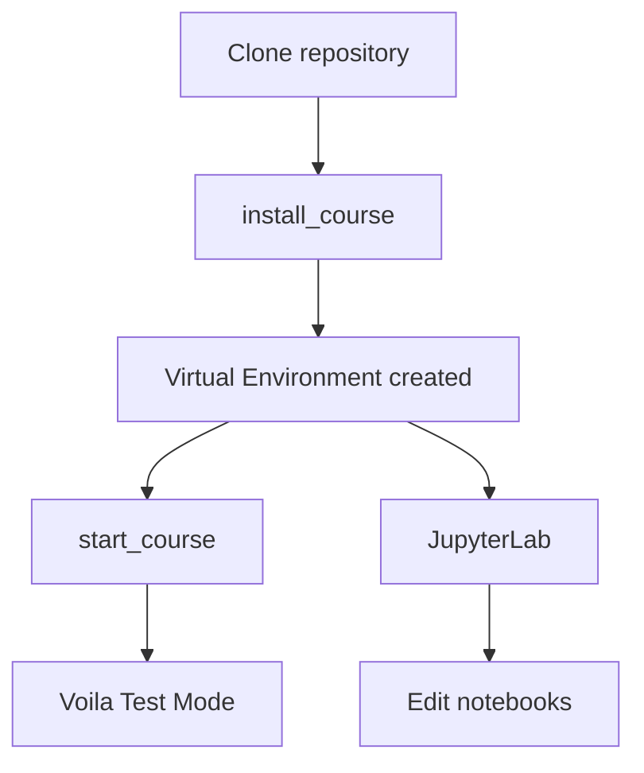

# ⚙️ Перший запуск курсу (обовʼязково)

Перед початком роботи потрібно **налаштувати Python-середовище**.

Це робиться **один раз після клонування репозиторію**.

Скрипт автоматично:

* створить `.venv`
* встановить всі бібліотеки
* налаштує Jupyter kernel

---

# 🪟 Windows

У папці проєкту **двічі натисніть**:

```
install_course.bat
```

Скрипт автоматично:

* створить `.venv`
* встановить всі бібліотеки
* зареєструє Jupyter kernel

Після завершення з’явиться повідомлення:

```
Setup complete!
Now run: start_course.bat
```

---

# 🍎 macOS / 🐧 Linux

Відкрийте **Terminal** у папці проєкту.

Перейдіть у папку репозиторію:

```bash
cd ~/PY-Course-Victor-Nikoriak-23_02
```

Перевірте що ви у правильній папці:

```bash
ls
```

Ви повинні побачити:

```
install_course.py
start_course.py
requirements.txt
01_variables/
```

Тепер запустіть налаштування середовища:

```bash
python3 install_course.py
```

Приблизний результат:

```bash
Creating virtual environment...
Installing dependencies...
Done.
```

---

# 🚀 Запуск курсу

Після встановлення середовища можна запускати курс.

---

## 🪟 Windows

```
start_course.bat
```

---

## 🍎 macOS / 🐧 Linux

```bash
python3 start_course.py
```

---

Після запуску з’явиться меню:

```
----------------------------------------
Python Course -- Select Lesson
----------------------------------------

[1] 01_variables / ...
[2] 02_conditions / ...
[3] 03_loops / ...
...
```

Введіть номер уроку та натисніть **Enter**.

Після цього:

* відкриється браузер
* запуститься Voila
* відкриється обраний notebook

---

# 🧪 Режим тестів (через launcher)

Launcher використовує **Voila**.

Це означає:

* системні клітинки приховані
* інтерфейс чистий
* працює як тестова система
* не потрібно нічого налаштовувати

Цей режим використовується для:

* тестів
* контрольних
* захищених завдань

---

# 📓 Робота через JupyterLab (альтернатива PyCharm)

Якщо у вас:

* PyCharm **Community Edition**
* або **немає PyCharm**

ви можете працювати через **JupyterLab у браузері**.

---

## 1️⃣ Активуйте середовище

### Windows

```bash
.venv\Scripts\activate
```

### macOS / Linux

```bash
source .venv/bin/activate
```

---

## 2️⃣ Запустіть JupyterLab

```bash
jupyter lab
```

Після запуску автоматично відкриється браузер:

```
http://localhost:8888
```

---

## 3️⃣ Відкрийте урок

Перейдіть у папку уроку:

```
04_boolean_logic_and_control
```

та відкрийте файл:

```
python_lesson_bool_logic_student.ipynb
```

---

# 🧠 Який режим обрати?

| Режим | Для чого використовується                 |
|------|-------------------------------------------|
| `start_course` | проходження тестів та контрольних завдань |
| `JupyterLab` | редагування коду та експерименти з Python |
| `PyCharm` | повноцінна розробка Python-проєктів       |

---

# 🔁 Повторний запуск

## Windows

двічі натиснути

```
start_course.bat
```

---

## macOS / Linux

```bash
python3 start_course.py
```

---

# ⚡ Повний workflow (швидка схема)

Як виглядає типовий запуск курсу:

```bash
cd PY-Course-Victor-Nikoriak-23_02
python3 install_course.py
python3 start_course.py
```

---

# 🔄 Схема запуску



---
