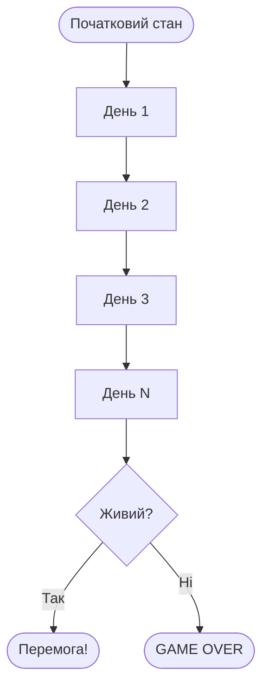
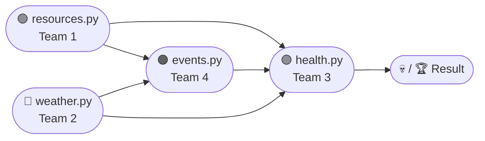

# Survival Simulator — Навчальний Проєкт

Симулятор виживання для вивчення модульного програмування, управління станом та командної роботи з Git.

---

## 📁 Структура проєкту

```
survival_simulator/
├── main.py          ← точка входу, запускає гру
├── models.py        ← початковий стан гравця
└── modules/
    ├── resources.py ← TEAM 1: пошук їжі
    ├── weather.py   ← TEAM 2: погода
    ├── events.py    ← TEAM 4: випадкові події
    └── health.py    ← TEAM 3: здоров'я
```

---

## ▶️ Як запустити

```bash
cd generator/survival_simulator
python main.py
```

---

## 🔗 Контракт модулів

Кожен модуль повинен мати функцію:

```python
def run(state: dict) -> dict:
    return state
```

Порядок виклику: `resources → weather → events → health`

---

## ⏳ Симуляція у часі

Гра триває кілька днів (за замовчуванням — **5 днів**).

`state` — це словник, який передається від дня до дня:

```python
state = {"health": 100, "energy": 100, "food": 0}
```

Кожен день всі модулі змінюють цей словник по черзі. Результат одного дня **впливає на наступний**:

- залишилось мало `energy` після шторму → наступного дня легше отримати GAME OVER
- `health` впав від травми → ще один поганий день може вбити гравця



👉 **Помилки накопичуються** — один поганий модуль може зіпсувати всю гру через кілька днів.

👉 **Система динамічна** — кожен запуск дає різний результат через `random`.

👉 **Модулі взаємозалежні** — `resources` впливає на `health`, `weather` впливає на шанс виживання.

---

## 💀 Умови завершення гри

| Умова | Повідомлення |
|-------|-------------|
| `energy <= 0` | You are too exhausted to go on... GAME OVER |
| `health <= 0` | You died from your injuries... GAME OVER |
| Пройшли всі дні | You survived! Congratulations. |

Перевірка відбувається **після кожного дня** — як тільки одна з умов спрацьовує, гра зупиняється.

---

## 🧩 Команди та модулі

| Команда | Файл | Git-гілка |
|---------|------|-----------|
| Team 1 | `modules/resources.py` | `team1/resources` |
| Team 2 | `modules/weather.py` | `team2/weather` |
| Team 3 | `modules/health.py` | `team3/health` |
| Team 4 | `modules/events.py` | `team4/events` |

Кожна команда працює у своїй гілці і відкриває Pull Request до `main`.

---

## 🔗 Залежності між командами (Dependency Diagram)



### 🧠 Як читати цю діаграму

👉 Кожна стрілка означає: **"цей модуль впливає на інший"**

---

### 📊 Пояснення залежностей (простою мовою)

#### 🟢 Resources → Health

- `resources.py` додає `food` до `state`
- `health.py` читає `state["food"]`:
  - якщо `food = 0` → `health` падає на 10
  - якщо `food > 0` → `health` росте на 5

> 💀 **Висновок:** якщо Team 1 зробить помилку і не додасть їжу → Team 3 "вб'є" гравця кожен день

---

#### 🟢 Resources → Events

- Якщо є `food` → гравець сильніший і краще переносить події

---

#### 🔵 Weather → Events

- Погода могла б впливати на шанс певних подій:
  - `Storm` → більше шансів на `Injury`
  - `Sunny` → більше шансів на `Bonus`
- Це  **демонструє, що системи пов'язані**

---

#### 🔵 Weather → Health

- `weather.py` змінює `state["energy"]`
- Якщо `energy` падає до `0` → `main.py` зупиняє гру
- Шторм кілька днів поспіль = майже гарантований GAME OVER

---

#### 🟠 Events → Health

- `events.py` напряму змінює стан гравця:
  - `"Injury"` → `-10` до `state["health"]`
  - `"Bonus"` → `+10` до `state["energy"]`
- Якщо в той же день `health.py` теж знімає HP (немає їжі) → за один день можна втратити **20 HP**

---

#### 🟣 Health → Result

- `health.py` — останній модуль у ланцюгу
- Він визначає фінальне значення `state["health"]`
- `main.py` перевіряє: `health <= 0` → гравець мертвий

---

### 💣 НАЙВАЖЛИВІШЕ 

Система працює як **ланцюг**:

```
Resources → Weather → Events → Health
```

Якщо **один модуль** працює неправильно — вся система дає неправильний результат.

---

### 🧠 META 

> Це не просто "4 окремих файли".
> Це **система взаємозалежностей**, де кожна команда несе відповідальність не тільки за свій модуль — а за поведінку всієї гри.
